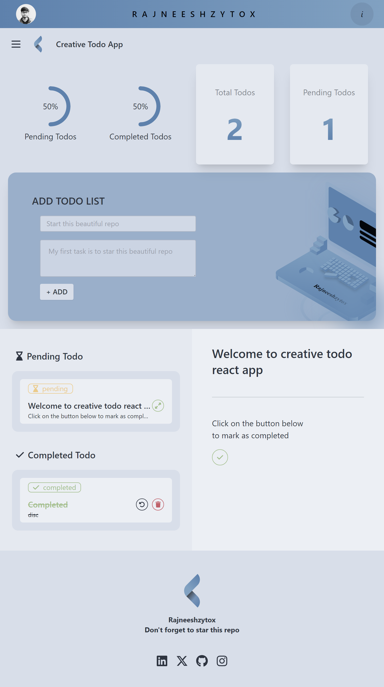
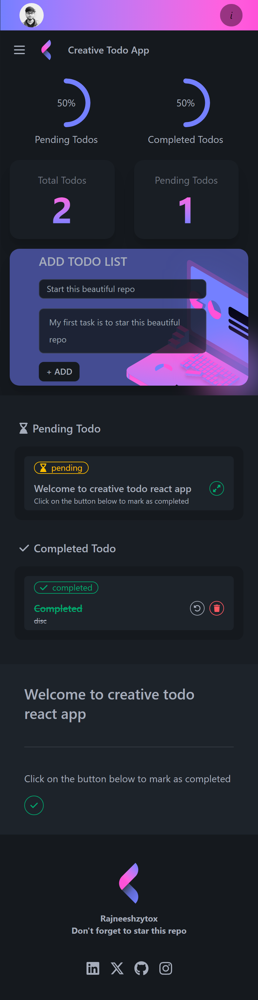

# Creative Todo React App

This project is a Todo application built to learn and demonstrate the fundamentals of React. The app is developed using Vite, React, TailwindCSS, and DaisyUI. It covers essential React concepts such as components, props, rendering components using the `map` function, and editing arrays of objects in state.

## Live Preview 
[go to site](https://creative-todo-rajneeshzytox.netlify.app/)


## Features

- **Add Todo**
- **Show Todo**
- **Mark as complete**
- **Restore Todo to pending**
- **Delete Todo**
- **Progress Dashboard**
- **Multiple Themes (Svg also Changes with themes)**


## Technologies Used

- **Vite**: For fast and efficient development.
- **React**: The core library for building the user interface.
- **TailwindCSS**: Utility-first CSS framework for styling.
- **DaisyUI**: TailwindCSS components for additional UI elements.

## Fully Responsive
- **Tab**

- **Mobile**


## Download & Run

```Don't forget to star```
To get a local copy up and running, follow these simple steps:

### Prerequisites

- Node.js
- npm 

### Installation

1. Clone the repo
   ```sh
   git clone https://github.com/Rajneeshzytox/React-Todo-App.git
   ```
2. Install NPM packages
   ```sh
   npm install
   ```

### Usage

1. Start the development server
   ```sh
   npm run dev
   ```


2. Open your browser and navigate to `http://localhost:5173/` to see the app in action.


---
## Contact
- **Email**: kumarrajneesh.work@gmail.com
- **LinkedIn**: [rajneeshzytox](https://www.linkedin.com/in/rajneeshzytox/)
- **Instagram**: [rajneeshzytox](https://instagram.com/rajneeshzytox)
- **Twitter (X)**: [rajneeshzytox](https://x.com/rajneeshzytox)
- **Portfolio**: [rajneeshzytox](rajneeshzytox.github.io/portfolio)